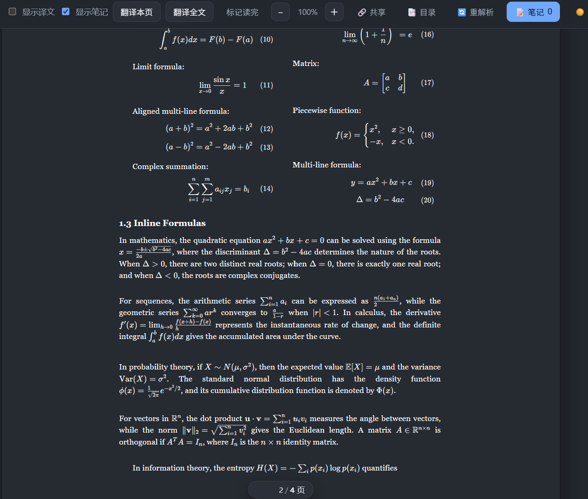
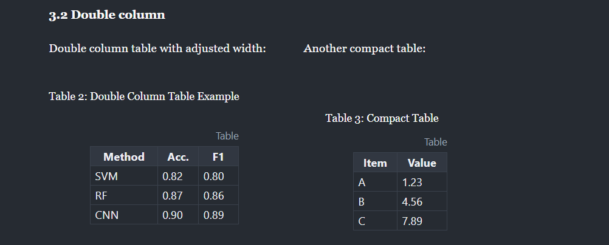
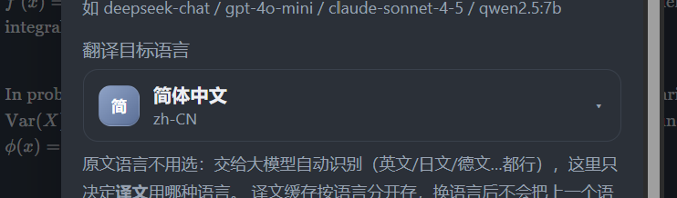
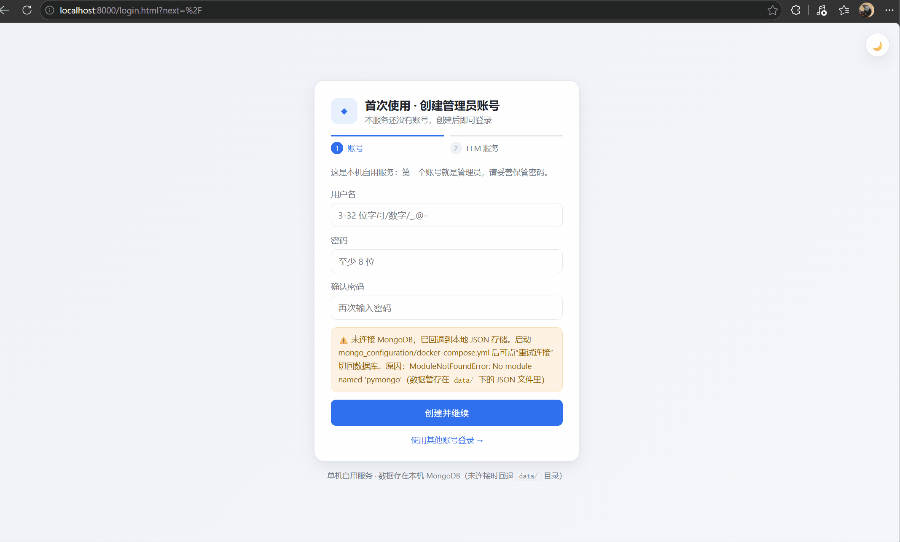
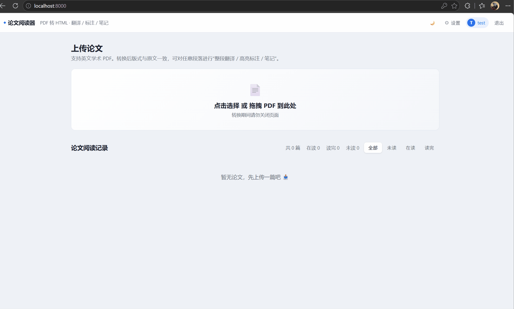
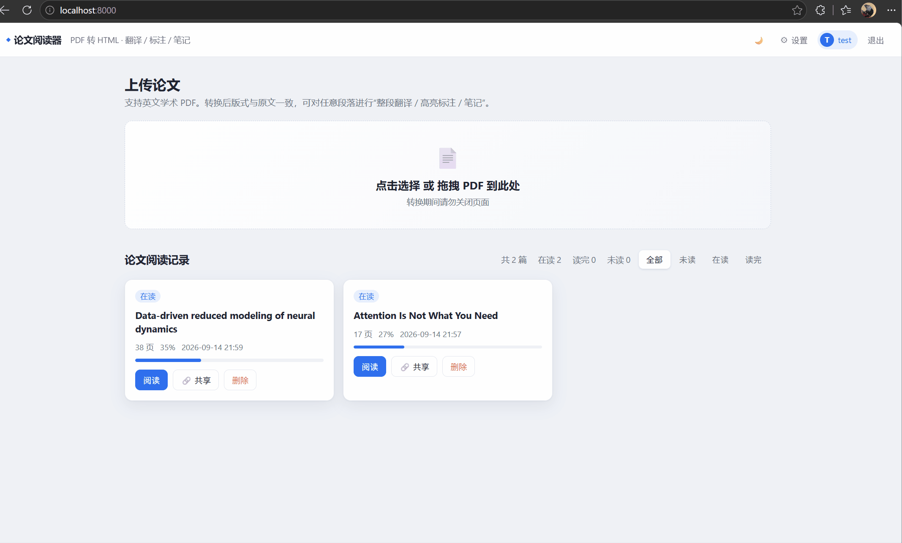
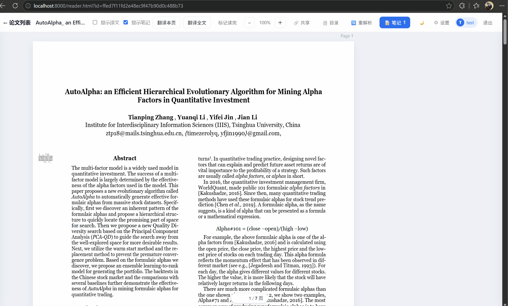
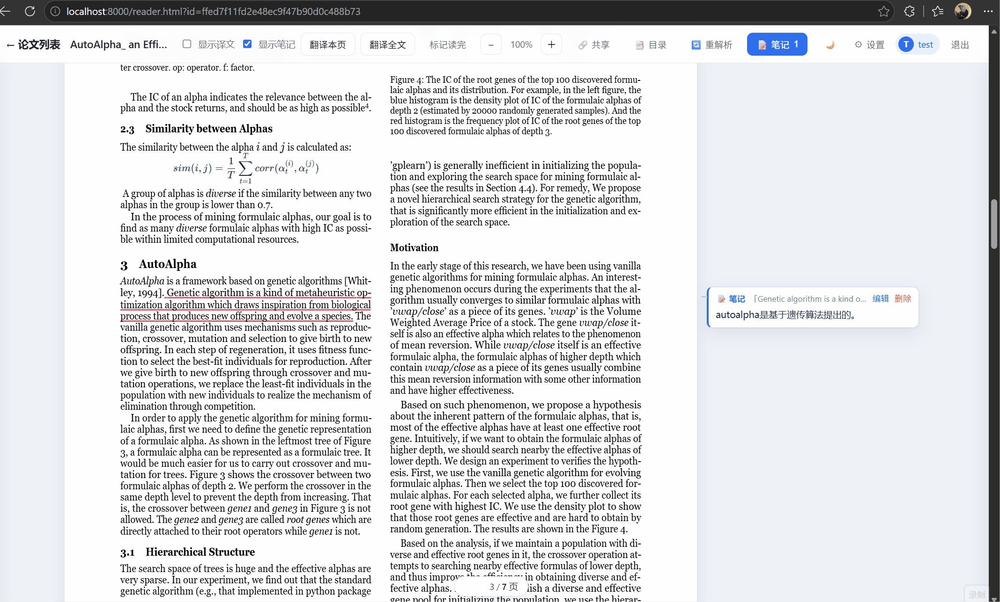

# CrockRoach Paper Reader - Pdf 转 HTML 阅读应用

> AI 辅助工具为 Deepseek-v4-flash/Deepseek-v4.1-flash + VScode copilot

## 更新

1. [26/10/8] surya 解析与pymupdf解析分离，解析pdf和渲染路径独立，解决了surya解析时公式和图片重影问题，增加表格渲染
   

    
   

2. [26/10/8] 增加了多种翻译目标语言
   

   
   

3. [26/10/8] ai辅助阅读增加markdown样式渲染。

## Pdf 解析模块

把论文 PDF 解析成**可还原原版式的数据**（文字块 + 插图，保留原坐标、字号、字体）。提供三种解析方式，输出结构一致，前端无需改动。

### 1. 本地模式

不依赖显卡和外部服务，装好即用，也是其他方式不可用时的**兜底**。

- 文字按 PDF 原始行框、字号、字体、颜色还原；
- 自动提取插图（内嵌图片与矢量图表），过滤整页背景、过小贴图；
- 不具备数学语义，公式按原文文字显示。

### 2. Surya

接入 **Surya 2 推理服务**，由服务端做版面分析与整页识别（部署方式见 `surya_doc_parse_service`）。

- 按版面分块还原阅读顺序，插图自动裁剪保存；
- 表格保留结构，公式识别为 LaTeX 并渲染成数学公式；
- 电子版论文仍以原始精确版式为准，扫描件用识别结果还原。

<!-- ### 3. Paddle-OCR

接入 **PaddleOCR-VL 推理服务**，推理速度最快，**推荐有显卡时使用**（部署方式见 `paddle_ocr_doc_parse_service`）。

- 逐页识别，补齐插图和公式（公式同样输出 LaTeX）；
- 电子版论文保留原有精确版式，扫描件也能较好还原；
- 个别页面识别失败不影响整篇，该页自动改用本地模式。

> 三种方式都会避免插图与文字叠成“重影”。服务在运行时会自动优先使用，服务不可用则自动降级到本地模式，不会因此打不开论文。实测surya的图片和公式提取能力更好，paddle-ocr速度更快。 -->

## MongoDB 数据存储

论文数据全部存放在 MongoDB（部署方式见 `mongo_configuration/`，Docker Compose 一键启动）。默认只监听本机，只有本机上的应用能连，更适合个人使用。

存放内容：

- **论文** —— 元数据、页数、阅读进度与状态，以及论文归属的账号；
- **版式数据与插图** —— 解析结果与论文插图，重启、重建容器、换机器都不会丢；
- **高亮 / 笔记 / 译文** —— 标注与译文缓存，相同句子不重复翻译；
- **账号与会话** —— 登录账号（口令加盐哈希存储）、登录会话（过期自动清理）、每个账号各自的偏好与 LLM 配置。

数据按账号隔离：每个账号只能看到并操作自己上传的论文。

数据库没启动也能正常用：应用会自动回退到本地文件存储并在页面上提示，点「重试连接」即可切回数据库，不用重启服务。

## LLM 设置
LLM 设置预设了OpenAI、Anthoripic、deepseek和本地模式可供选择，实现上来说没有固定base url，可以任意选择，能够保存的设置只有3套。

## 使用功能

### 1. 多用户

### 2. 设置

### 3. 论文载入和删除

### 4. 标注、笔记和翻译

### 5. 笔记整理和AI辅助

### 6. 笔记共享

## TODO

- [x] ~~公式解析优化，重影缺失等问题~~
- [x] ~~图片显示，子图caption重影缺失等问题~~
- [ ] pymupdf 本地解析优化
- [ ] unlimited ocr 解析和渲染路径实现

<!-- https://github.com/MarcYugo/crockroach-paper-reader -->